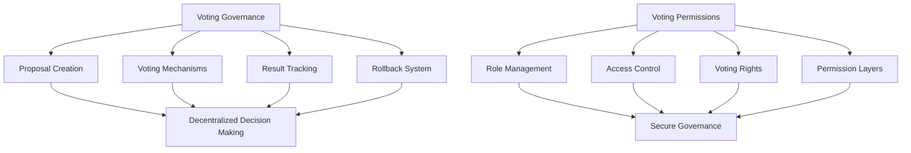

# Voting Rollback

A decentralized governance system with advanced voting and decision rollback capabilities on the Stacks blockchain.

## Overview

Voting Rollback enables organizations to:
- Create transparent and secure voting proposals
- Implement multi-tier voting rights
- Allow democratic decision-making
- Provide mechanisms for rolling back controversial decisions

Key Features:
- Flexible voting mechanism
- Role-based access control
- Proposal submission and tracking
- Decision revocation capabilities
- Secure, blockchain-based governance

## Architecture

The platform consists of two core smart contracts managing governance and permissions:



## Contract Documentation

### Voting Governance (`voting-governance.clar`)

Core contract managing voting mechanisms:

- Proposal submission
- Voting process
- Result calculation
- Rollback capabilities

Key Features:
- Configurable voting periods
- Multiple voting strategies
- Proposal tracking
- Decision reversal mechanisms

### Voting Permissions (`voting-permissions.clar`)

Handles access control and voting rights:

- Role-based permission management
- Voting power allocation
- Tier-based participation
- Dynamic rights management

## Getting Started

### Prerequisites
- Clarinet
- Stacks wallet
- STX tokens for transactions

### Basic Usage

1. Creating a proposal:
```clarity
(contract-call? .voting-governance create-proposal "proposal-details" u100)
```

2. Casting a vote:
```clarity
(contract-call? .voting-governance cast-vote proposal-id vote-choice)
```

3. Configuring voting permissions:
```clarity
(contract-call? .voting-permissions set-voting-rights principal voting-tier)
```

## Function Reference

### Governance Contract Functions

#### Proposal Management
```clarity
(create-proposal (details (string-utf8 256)) (voting-duration uint))
(vote-on-proposal (proposal-id uint) (vote-choice uint))
(execute-proposal (proposal-id uint))
(rollback-proposal (proposal-id uint))
```

### Permissions Contract Functions

#### Rights Management
```clarity
(set-voting-rights (user principal) (voting-tier uint))
(revoke-voting-rights (user principal))
(check-voting-eligibility (user principal) (proposal-id uint))
```

## Development

### Testing
Run tests using Clarinet:
```bash
clarinet test
```

### Local Development
1. Start local chain:
```bash
clarinet integrate
```

2. Deploy contracts:
```bash
clarinet deploy
```

## Security Considerations

### Governance Contract
- Proposal validation mechanisms
- Voting period enforcement
- Rollback protections
- Transparent decision tracking

### Permissions Contract
- Strict access control
- Dynamic rights management
- Prevention of unauthorized voting
- Role-based participation limits

### General
- Cryptographically secure voting processes
- Immutable proposal and voting records
- Prevention of double-voting
- Transparent governance mechanisms